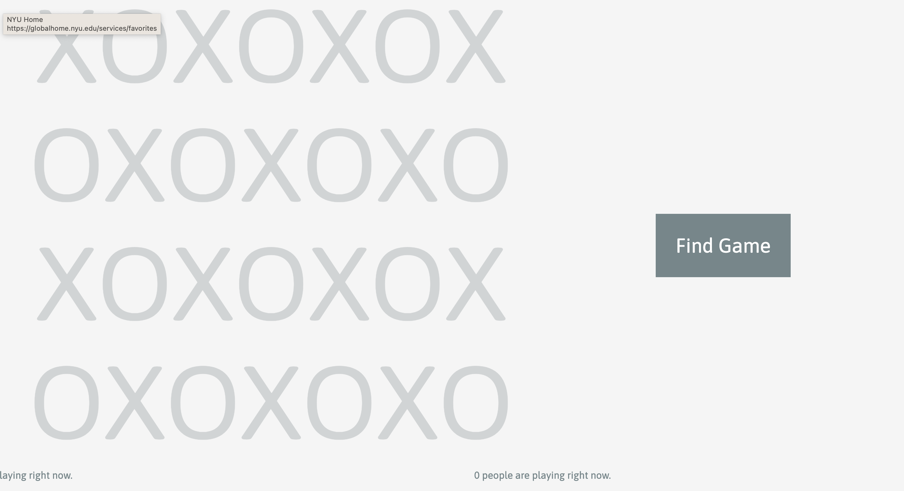
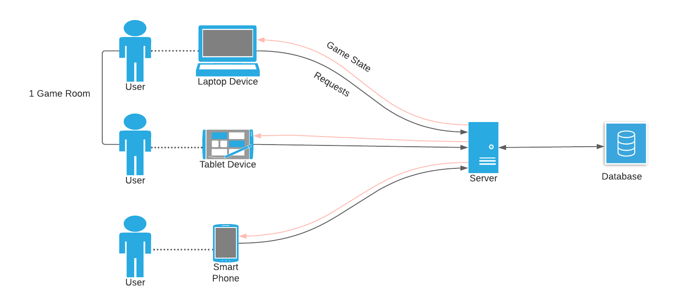

# Tic-Tac-Toe Game
A online multiplayer tic-tac-toe game server!
<a href="https://xoxo-game.glitch.me/">Try it out!</a>



## Summary
A multiplayer game server that allows users to play tic-tac-toe with anyone online anonymously. It is built to support over 3 million simultaneous online game rooms. The personal goal of the project is to explore web sockets and backend development with APIs.

## Installation
1. Install a package manager like npm, yarn, brew. I use [npm](https://www.npmjs.com/) Note: npm is the standard package management system for Javascript based projects.
2. Navigate to your project directory in the terminal.
3. Run the command <code>npm install</code> to install project dependencies.
4. Run <code>npm start</code> to run a local development server.
5. Visit [http://localhost:3000](http://localhost:3000/) to view live site.

## Process
The architecture of this project entails a server that communicates with multiple clients and saves the game state of each room in a database. For simplicity sake and to focus mainly on the API development, the multiplayer game will be Tic Tac Toe with only 2 players per room. I will be using a json file as the database, but eventually will expand to use other database infrastructure such as SQL. I am building an [express](https://href.li/?https://www.npmjs.com/package/express) server with Node.js and [express-ws](https://href.li/?https://www.npmjs.com/package/express-ws).



The main endpoints of the server are:

GET: /game (Serve game page.)

GET: /start (Find an open session. If none are open, start a new session. Send back session ID.)

GET: /sessionStatus (Sends back true or false if room is full and the game is ready to be played.)

GET: /clients (Gets all the active clients using webhook connections.)

WEBSOCKET: /:sessionID (Establish webhook connection for client. Sends current game state with with all moves as soon as new message from client is received)

The schema of the database is as follows:

```
{
  "sessionId": {
    "players": int,
    "data": array of strings
  }
}
```
Example data:

```
{
    "HPYXEL": {
      "players": 2,
      "data": ["X","O","X","X"]
    },
    "IZIEHK": {
      "players": 1,
      "data": []
    }
}
```

The work flow is as follows:

1. Users arrive at home page.
2. Can read game instructions.
3. Can view how many players are online
4. Press “Find Game” to begin.
5. When “Find Game” is pressed, client sends GET “/start” request and receives session ID. Players are assigned to a random open room.
6. Client sends WEBSOCKET: “/:sessionID ‘request and connection is established.
7. Client sends GET “/sessionStatus” request to determine if room is full.
8. When room is full, game begins. Database gets updated as users play and send new plays via webhook.
9. Game ends and players are taken to the Home page.
10. Users have the option to play again with the same opponent.

## Future Work

Time permitting, I would like to explore the following features:

- Allow users an option to “Host Game” or “Join by ID” to play with friends.
- Users can name themselves before starting a game.
- Have a text-based chat or voice chat for each game room.

## License
Please reach out if you would like to fork this project or contribute to development. Include attribution in any work that stems from this!

## Author

* [Julie Lizardo](https://www.linkedin.com/in/julie-lizardo/)  -- [Web Developer](https://julielizardo.com/)
